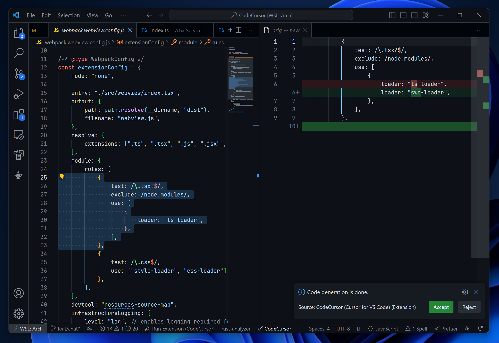

# CodeCursor (Cursor for Visual Studio Code)

**Use Cursor right in the editor you love!**

First of all, we would like to thank **Cursor Team** for their brilliant works. Please give their [app](https://www.cursor.so) a try!

## What's Cursor? And Why This Extension?

Cursor is an AI code editor based on OpenAI GPT models. You can write, edit and chat about your code with it. At this time, Cursor is only provided as a dedicated app, and the team currently has no plans to develop extensions for other editors or IDEs.

We believe there are more developers actively use Visual Studio Code as their main tool for serious works. And this is why we built **CodeCursor**. It's not going to replace the Cursor app, but it provides another way to use Cursor.

## Getting Started

You have to sign in the Cursor account or configure you own API keys to use this extension. Please refer to the [Custom API Keys](#custom-api-keys) section for details.

### 🌟 **Experimental**: Generate entire projects with the AI 🌟

We bring the experimental features of Cursor's latest AI-generated projects to CodeCursor. Now you can directly create entire projects through AI in VSCode.

When you have opened a workspace, you will be able to see the `Generate Project` command in the Command Palette.

If the currently opened workspace is not empty, you will receive a warning dialog asking if you want to continue.

While project generation is in progress, a progress dialog will be displayed. You can click the cancel button on the progress bar at any time to cancel the task.

### Code Generation

Just open a document and type `CodeCursor` in Command Palette. You will see the command below:

Type your prompt and the code generation will just begin. To edit some existing code, you can also select something before perform this command, when accepting the change, the selected code will be replaced with the generated one.

While code generation is in progress, the following status bar item will be displayed:

Click on it to cancel the request. Upon completion of code generation, the status bar item will change a "check mark". You can click it reopen the generated result at any time.

The generated contents will be live streamed, and shown as a text diff. You can simply apply the changes by clicking "Accept" button in the notification:

### Chat

You can chat with your code just like using ChatGPT. To open the chat panel, click "CodeCursor" icon on the Activity Bar. You can ask questions about the currently opened document or a selected piece of text.

## Custom API Keys

Cursor server may become unstable when it's under heavy traffic. You can provide your own OpenAI API keys to have a smoother user experience. You can also choose the model you want to use when a key is set. For details, please refer to the extension configuration.

> **Note:**  
> Your API key will be sent to Cursor server.

## Known Issues

-   Due to limitations in the new version of the Cursor API, the automatic continuation ability for long code is currently unavailable.
-   If you trigger `Generate Project` command multiple times simultaneously, undefined behavior may occur.

To track all issues / file a new issue please go to the Github repo.

## Security Consideration

The extension **DOES NOT** collect your code, environment data, or any information that could be used to track you. Additionally, we ensure that the Cursor server will not receive those data either. Only the document you perform code generation against will be uploaded to the Cursor server, and they are responsible for preventing any leaks of your code.

## Contributing

To develop the extension, clone the repository and open it in Visual Studio Code. There are two launch targets: "Run Extension" and "Run Extension (Without Rust)". if you only want to debug or work on the UI parts, then you can select "Run Extension (Without Rust)" for faster build speed.

You are welcome to open Pull Requests at any time. But it's still better to start a discussion before making some epic changes.

## License

MIT
